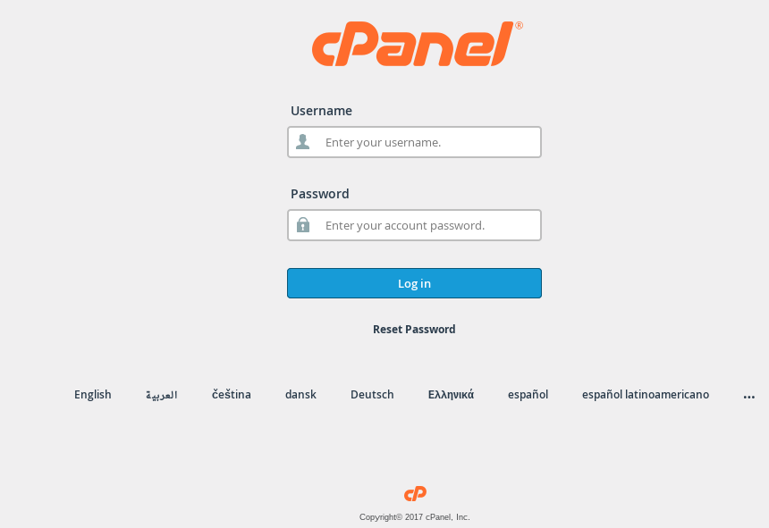

# cPanel brute forcer

#### fr
1. Vous devez savoir le nom d'utilisateur.
Il y a plusieurs méthodes pour le savoir.
http://www.google.fr :)

1. Vous devez avoir un trés grand dictionnaires des mots de passe.

1. Lancer le script

#### en
1. You have to know the username.
There are few methods to get it.
http://www.google.com :)

1. You must get a very huge passwords dico. file.

1. Launch the script

